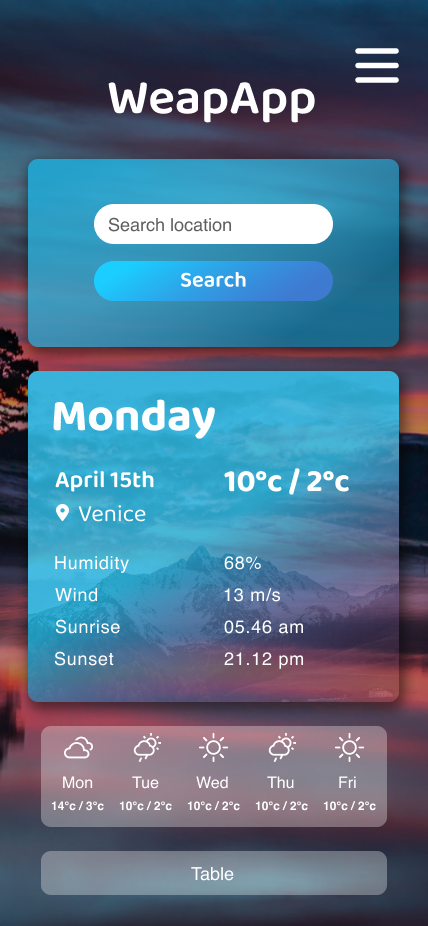
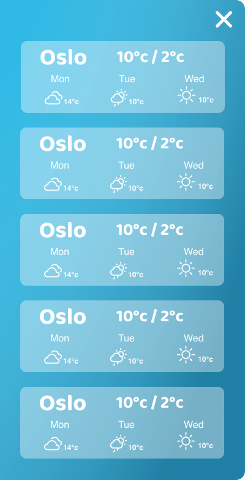

# WeapApp

## Description

My first encounter with React, a school assignment where I
were to build a weather web app.

It's built in React, styling written in SASS and using the [openweathermap.org](https://www.openweathermap.org/)

A visitor will initially have to allow access for to get their position to display data. Further the visitor can search for locations.

## Requirements for the assignment

The application should be able to display:

Weather conditions for current position

- Temperature
- Wind speed
- Humidity
- Sunrise/ sunset (time)
- be able to choose Celcius or Fahrenheit for temperature display

Display weather forecast with info above

- Brief overview forecast for 5 days ahead (temperature and some other info)
- Information for the rest of the current day by hour (every hour or every third hour) with some info as (temperature, current weather, wind speed, and humidity)
- Additional info is a plus
- Use a weather API e.g SMHI, YR.NO, OpenWeatherMaps
- Use positioning with geolocation in the browser
- Design/ coulors & shape should keep a clean and easy layout

## Getting started

1. Open a terminal/ navigate to the desired destination folder on your computer.
2. Clone the project with the command: `git clone -b local-development git@github.com:chas-academy/u07-weather-app-Niclas-Gustafsson.git` (example is SSH!)
3. Open the project in your preferred IDE.
4. Open your browser and head over to [openweathermap.org](https://www.openweathermap.org/) and create an account, it is the recipe API used for this project (It’s free!)
5. Once logged in, click your username and choose "My API Keys", copy the key to your clipboard and go back to your IDE where the project is open.
6. In the project root, create a file called .env and type the exact variable name: REACT_APP_WEATHER_API_KEY=[The API key you copied goes here after the = without square brackets], Example: REACT_APP_WEATHER_API_KEY=123my4api5key56
7. Save the file.
8. Open an integrated terminal and run the command: npm i This will install the required dependencies for the project. Shouldn’t take too long.
9. Next, run the command: “npm run start” or “npm start” this will serve the project in the browser at http://localhost:3000.

## Tools and languages used

- React
- JavaScript
- SASS
- Netlify

## Design

I wanted an easy block-wise layout in one screen. Which narrowed down the screen real estate immensely. I began designing mobile first and also didn't want to spend too much time designing and code the frontend. I wanted to be able to focus on the logic and react itself, but still have something simple to show that wasn't bootstrap or a 90's website.

As the image above, I wanted a navbar-like toggle. This was initially thought of being used to toggle a sidebar which would contain stored locations. According to below.

Though I discarded this idea for turning the assignment in, but kept the layout and put my "hourly display" in it instead. I had also forgot that I needed a Celcius/ Fahrenheit toggle so I turned the, now, not used button at the bottom to a temp converter.
